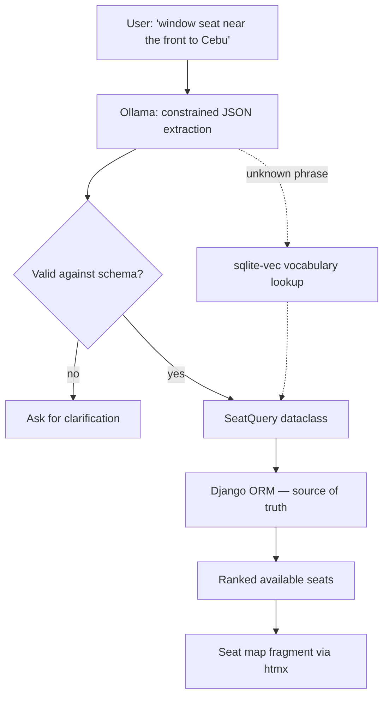

# Architecture

Technical design for the Airline Reservation System (ARS). This document is the
reference for how the three core requirements are met and how the natural-language
seat search is structured.

- **Stack:** Django 6.1, SQLite, htmx, Tailwind CSS v4
- **Auth:** none — kiosk-style, a passenger name is typed at booking time
- **Scope:** many flights, one shared cabin layout, single class

---

## 1. Domain Model

Four models in a single `reservations` app.

```
Flight  ──┐
          ├──< Booking >──  Passenger
Seat    ──┘
```

### Seat is a shared catalog, not per-flight

Because every flight uses the same cabin layout, `Seat` holds each **position**
in the cabin exactly once (180 rows total for a 30×6 cabin), and *all* flights
reference that same catalog. Seat occupancy is a property of `Booking`, not of
`Seat`.

The alternative is copying 180 `Seat` rows per flight — was rejected: it
multiplies storage by the flight count and makes "seat 12C" ambiguous across
flights for no benefit while the layout is uniform.

> **If a second aircraft layout is ever introduced**, this decision reverses:
> `Seat` gains an `Aircraft` foreign key and `Flight` points at an `Aircraft`.
> That is the single most likely future migration.

```python
class Seat(models.Model):
    row = models.PositiveSmallIntegerField()          # 1..30
    column = models.CharField(max_length=1)           # 'A'..'F'

    class Meta:
        constraints = [
            models.UniqueConstraint(fields=['row', 'column'], name='unique_seat_position'),
        ]
        ordering = ['row', 'column']                  # defines "first available"

    @property
    def designation(self) -> str:
        return f'{self.row}{self.column}'             # "1A"


class Flight(models.Model):
    number = models.CharField(max_length=10, unique=True)   # "PR101"
    origin = models.CharField(max_length=3)                 # IATA, "MNL"
    destination = models.CharField(max_length=3)            # "CEB"
    departs_at = models.DateTimeField()


class Passenger(models.Model):
    full_name = models.CharField(max_length=120)


class Booking(models.Model):
    flight = models.ForeignKey(Flight, on_delete=models.CASCADE, related_name='bookings')
    seat = models.ForeignKey(Seat, on_delete=models.PROTECT, related_name='bookings')
    passenger = models.ForeignKey(Passenger, on_delete=models.CASCADE)
    created_at = models.DateTimeField(auto_now_add=True)

    class Meta:
        constraints = [
            models.UniqueConstraint(fields=['flight', 'seat'], name='unique_seat_per_flight'),
        ]
```

**`UniqueConstraint(flight, seat)` is the system's correctness guarantee.**
Everything else in the booking path is a nicety layered on top of it.

### Cabin layout configuration

```python
# settings.py
CABIN_ROWS = 30
CABIN_COLUMNS = 'ABCDEF'
```

A data migration seeds the `Seat` catalog from these values. They are *not* read
at request time — changing them after seeding requires a new migration, since the
seeded rows are the source of truth.

### Availability

Availability is derived, never stored — there is no `is_taken` flag to fall out
of sync:

```python
def available_seats(flight):
    return Seat.objects.exclude(bookings__flight=flight)
```

---

## 2. Core Requirement 1 — Display available seating

Rendered two ways from one source of truth.

### Web seat map

`GET /flights/<id>/` renders a Tailwind grid. The view builds a row-major
structure so the template stays logic-free:

```python
taken = set(
    Booking.objects.filter(flight=flight).values_list('seat_id', flat=True)
)
grid = [
    [(seat, seat.id in taken) for seat in row_seats]
    for row_seats in grouped_by_row
]
```

A single query for seats and a single query for taken IDs — no N+1 across 180
seats. The aisle is a rendering concern: a gap is inserted after column C via
``, not modeled in the database.

### Text rendering — the literal "print"

The requirement says *print*, so a management command renders the same data as
text, sharing the availability query with the web view:

```bash
uv run ars/manage.py print_flight PR101
```

```
PR101  MNL → CEB  2026-08-14 09:30
     A  B  C   D  E  F
 1   .  .  X   .  .  .
 2   X  X  .   .  .  .
        . = available    X = taken
```

---

## 3. Core Requirement 2 — Assign the first available seat

"First" is defined by `Seat.Meta.ordering = ['row', 'column']`: lowest row
number, then lowest column letter. Seat 1A is first; 30F is last.

```python
def assign_first_available(flight, passenger):
    with transaction.atomic():
        seat = (
            Seat.objects
            .exclude(bookings__flight=flight)
            .order_by('row', 'column')
            .first()
        )
        if seat is None:
            raise FlightFullError(flight)
        return Booking.objects.create(flight=flight, seat=seat, passenger=passenger)
```

The gap between the `SELECT` and the `INSERT` is a genuine race. Section 5
covers how it is closed.

---

## 4. Core Requirement 3 — Assign a specific seat

Input is a designation string like `"1A"`, `"12c"`, or `"7 D"`, which must be
parsed and validated before it reaches the database.

```python
SEAT_RE = re.compile(r'^\s*(?P<row>\d{1,2})\s*(?P<column>[A-Za-z])\s*$')

def parse_designation(raw: str) -> tuple[int, str]:
    match = SEAT_RE.match(raw)
    if not match:
        raise InvalidSeatError(f'{raw!r} is not a seat designation like "12C".')
    return int(match['row']), match['column'].upper()
```

Four distinct failure modes, each with its own message — collapsing them into one
"invalid seat" error makes the UI meaningfully worse:

| Condition | Response |
|---|---|
| Malformed string (`"99ZZ"`) | `InvalidSeatError` — "not a seat designation" |
| Well-formed but outside the cabin (`"45A"`) | `SeatNotFoundError` — "this aircraft has rows 1–30" |
| Exists but already booked | `SeatTakenError` — "12C was just taken" |
| Available | `Booking` created |

---

## 5. Concurrency

Two kiosks requesting 1A at the same instant must not both succeed.

### Policy: let both try, first commit wins

Neither request is turned away up front. A and B both reach the database; the
one whose `INSERT` commits first owns the seat, and the other is blocked with
"12C was just taken". Nothing is reserved in advance — there is no lock queue,
no seat hold, and no "checking availability…" step that could leave a seat
frozen behind an abandoned session.

The consequence to accept: **losing is discovered at commit, not at click.** A
passenger can tap a free-looking seat and still be refused a moment later, so
the error path is a normal outcome to design for, not an edge case. The seat map
self-heals on the next swap (§6), which keeps the window small.

Ordering is decided by SQLite's write lock, not by when a request arrived at the
server. Under contention the "first" request is the first to commit, which for a
kiosk-scale system is the only ordering worth guaranteeing.

> **First-available is the deliberate exception.** Blocking the loser is right
> when the passenger asked for *1A* specifically. When they asked for "any
> seat", failing them because someone else took 1A serves nobody — that path
> retries onto the next free seat instead (point 3 below).

### `select_for_update()` is not available here

Django's SQLite backend does **not** implement `SELECT … FOR UPDATE`. It inherits
`has_select_for_update = False`, and the query compiler skips the locking branch
entirely — no SQL is emitted **and no error is raised**. A `select_for_update()`
call on this stack silently does nothing while appearing to protect the code.

This is why the design does not depend on it.

### What actually protects the booking

1. **`UniqueConstraint(flight, seat)`** — enforced by SQLite itself. The losing
   transaction gets an `IntegrityError`. This is the guarantee; it cannot be
   raced past.
2. **Catch and translate**, rather than pre-checking:

```python
def book_seat(flight, seat, passenger):
    try:
        with transaction.atomic():
            return Booking.objects.create(flight=flight, seat=seat, passenger=passenger)
    except IntegrityError:
        raise SeatTakenError(seat)
```

3. **Retry for auto-assignment.** A specific-seat request should fail loudly —
the passenger asked for *1A*. First-available should simply take the next seat:

```python
for _ in range(MAX_ASSIGN_RETRIES):        # 3
    try:
        return assign_first_available(flight, passenger)
    except SeatTakenError:
        continue
raise CouldNotAssignError(flight)
```

The `transaction.atomic()` block must wrap the `create()` so a failed insert does
not poison an outer transaction — after an `IntegrityError`, Django marks the
transaction for rollback and any further query in that block raises
`TransactionManagementError`.

### SQLite settings

WAL mode lets the seat map be read while a booking is being written, and a busy
timeout absorbs brief write contention instead of failing instantly:

```python
DATABASES['default']['OPTIONS'] = {
    'init_command': 'PRAGMA journal_mode=WAL; PRAGMA synchronous=NORMAL;',
    'timeout': 20,          # seconds to wait on a locked DB
}
```

SQLite serializes writers at the database level, so throughput is bounded by one
writer at a time. For a kiosk-scale system this is a non-issue; it is the first
thing to revisit if this ever becomes a real service.

---

## 6. HTTP & htmx Interaction Design

Full page loads only on navigation. Every booking action swaps a fragment.

| Method & path | Name | Returns |
|---|---|---|
| `GET /` | `flight-list` | Flight list |
| `GET /flights/<id>/` | `flight-detail` | Full page: seat map + booking form |
| `POST /flights/<id>/book/` | `book-seat` | **Fragment** — updated seat map |
| `POST /flights/<id>/book/first/` | `book-first` | **Fragment** — updated seat map |
| `GET /flights/<id>/map/` | `seat-map` | **Fragment** — seat map alone |

Templates split so the fragment and the full page render the identical markup:

```
templates/reservations/
├── flight_list.html        departures board
├── flight_detail.html      
├── _seat_map.html          ← returned directly by booking POSTs
├── _seat.html              one seat button
└── _booking_result.html    ← success / error banner
```

### The kiosk camera

The seat map is drag/pinch/scroll navigable (`static/js/seatmap.js`, vanilla
Pointer Events — no library, nothing from a CDN). The pan/zoom transform is
applied to `#seat-map-canvas`, one level **above** the `#seat-map` fragment:

```
#seat-map-viewport   clips, owns the gestures
└── #seat-map-canvas transform: translate(...) scale(...)
    └── #seat-map    ← the swappable fragment
```

Putting the transform outside the fragment is what lets a booking swap refresh
the cabin without throwing away where the user was looking.

**Seat taps do not come from `click`.** The camera calls `setPointerCapture()`
so a pan that leaves the viewport keeps tracking, and capture retargets the
compatibility mouse events that follow — the real `click` is delivered to the
viewport, not to the seat under the finger. The camera therefore measures the
gesture itself and publishes a `seatmap:tap` CustomEvent carrying the
`pointerdown` target, which is the last honest answer available. A press that
travelled more than a few pixels was a pan and publishes nothing, so dragging
across the cabin never selects a seat.

Keyboard activation still arrives as a `click`, distinguished by
`MouseEvent.detail === 0`; without that guard a pointer tap would toggle twice.

### Selection state and the summary panel

Selecting a seat sets `aria-pressed="true"` on the seat button and opens the
`#reserve-panel` side sheet (`static/js/seat-selection.js`).

**State that JavaScript toggles is styled from `static/src/input.css`, not from
Tailwind classes swapped in JS.** Tailwind only compiles classes it can see in
the scanned templates, so a class named only inside a `.js` file produces no CSS
and fails silently at runtime. The selected-seat green, the panel's off-canvas
transform, and the reserve bar's shift are therefore plain CSS rules keyed off
`aria-pressed` / `data-open`.

Each seat is a button posting its own designation:

```html
<button hx-post=""
        hx-vals='{"seat": "{{ seat.designation }}"}'
        hx-target="#seat-map"
        hx-swap="outerHTML"
        disabled>
  {{ seat.designation }}
</button>
```

Returning the whole map rather than the single clicked seat is deliberate: when
another kiosk books concurrently, the swap refreshes every seat, so the map
self-heals instead of drifting.

Errors return **HTTP 200 with an error fragment**, not 4xx — htmx does not swap
error responses by default, so a 409 would leave the user staring at an
unchanged page. The status banner is delivered as an out-of-band swap:

```html
<div id="booking-status" hx-swap-oob="true" class="text-red-600">
  Seat 12C was just taken.
</div>
```

CSRF is handled globally by `hx-headers` on `<body>` in `base.html`.

---

## 7. Natural-Language Seat Search

> **Design note.** This feature is **not** document retrieval, and building it as
> classic RAG would make it wrong. Embedding seat and booking rows and searching
> them by vector similarity fails on exactly the constraints that matter:
> similarity cannot enforce "row under 10", availability changes on every booking
> so the index is stale immediately, and re-embedding on each write is wasted
> effort. The database already answers these questions exactly.
>
> The architecture below therefore routes **facts through the ORM** and uses
> **vector search only where meaning is genuinely fuzzy** — mapping loose phrasing
> onto the system's vocabulary. This keeps sqlite-vec earning its place without
> making it the source of truth for availability.

### Pipeline



### Step 1 — Structured extraction, never SQL

The LLM's only job is turning prose into a **validated filter object**. It never
emits SQL and never sees the database. This is the security boundary: a prompt
injection can at worst produce a strange-but-valid filter, never arbitrary SQL.

```python
@dataclass(frozen=True)
class SeatQuery:
    flight_number: str | None = None
    destination: str | None = None          # IATA
    position: Literal['window', 'aisle', 'middle'] | None = None
    max_row: int | None = None
    min_row: int | None = None
```

Ollama is called with `format=<json-schema>` so decoding is constrained to the
schema rather than parsed hopefully from prose. Fields the model invents are
dropped; out-of-range values are clamped or rejected before the query runs.

### Step 2 — Position is derived, not stored

With `CABIN_COLUMNS = 'ABCDEF'`, window is `{A, F}`, aisle is `{C, D}`, middle is
`{B, E}`. Computed from the layout constant so a layout change cannot leave a
stored flag stale:

```python
WINDOW = {CABIN_COLUMNS[0], CABIN_COLUMNS[-1]}
AISLE  = {CABIN_COLUMNS[len(CABIN_COLUMNS)//2 - 1], CABIN_COLUMNS[len(CABIN_COLUMNS)//2]}
MIDDLE = set(CABIN_COLUMNS) - WINDOW - AISLE
```

### Step 3 — Where sqlite-vec is used

Vector search handles **vocabulary resolution only**: phrases the extractor
doesn't recognise ("by the porthole", "up front", "near the loo") are embedded
and matched against a small curated set of canonical concept descriptions. The
match returns a *field value*, which then flows through the same validated
`SeatQuery`.

This corpus is small, static, and authored — it changes when the vocabulary
changes, never on booking. That is what makes it a legitimate use of an index.

```sql
CREATE VIRTUAL TABLE assistant_concept_vec USING vec0(
    concept_id INTEGER PRIMARY KEY,
    embedding  FLOAT[768]          -- nomic-embed-text
);
```

`vec0` is a virtual table outside the ORM's control. It is created via
`migrations.RunSQL`, and read through raw SQL in the retriever — no Django model
is mapped onto it.

### Step 4 — Loading the extension into Django

Django does not load SQLite extensions natively. The `assistant` app hooks
`connection_created`:

```python
def load_sqlite_vec(sender, connection, **kwargs):
    if connection.vendor != 'sqlite':
        return
    connection.connection.enable_load_extension(True)
    sqlite_vec.load(connection.connection)
    connection.connection.enable_load_extension(False)
```

**Environment requirement:** the Python interpreter's `sqlite3` module must be
built with extension loading enabled. Verified present on this machine
(SQLite 3.46.1). The stock macOS system Python is a known exception — contributors
there need a Homebrew or `uv`-managed Python.

### Local models via Ollama

| Role | Model | Notes |
|---|---|---|
| Generation / extraction | `qwen3:14b` | Already installed. Strong constrained-JSON support. |
| Embedding | `nomic-embed-text` | **Not yet installed** — `ollama pull nomic-embed-text`. 768 dimensions, matching the `vec0` table above. |

The embedding dimension is baked into the virtual table. **Changing embedding
model means dropping and rebuilding the index** — a migration, not a config edit.

Both are reached through a narrow provider interface (`assistant/providers.py`),
so swapping Ollama for a hosted API later touches one file. Ollama being local
means no API keys, no per-query cost, and no passenger phrasing leaving the
machine — worth stating explicitly, since NL queries can contain personal details.

### Failure behaviour

Ollama is a separate process that may be stopped. Every entry point degrades to
the ordinary seat map rather than erroring: if extraction fails or times out
(5s), the UI reports that smart search is unavailable and falls back to the
normal browse-and-click flow. **The three core requirements never depend on
Ollama running.**

---

## 8. Directory Layout

```
ars/
├── ars/                      project package (settings, urls)
├── reservations/             ← core booking domain
│   ├── models.py             Flight, Seat, Passenger, Booking
│   ├── services.py           assign_first_available, book_seat  (no HTTP here)
│   ├── selectors.py          available_seats, seat_grid
│   ├── exceptions.py         SeatTakenError, InvalidSeatError, …
│   ├── views.py              thin — parse, delegate, render
│   └── management/commands/print_flight.py
├── assistant/                ← natural-language search
│   ├── providers.py          Ollama client boundary
│   ├── extraction.py         prose → SeatQuery
│   ├── vocabulary.py         sqlite-vec concept lookup
│   ├── schema.py             SeatQuery dataclass + JSON schema
│   └── apps.py               connection_created → load sqlite-vec
├── templates/
└── static/
```

Business rules live in `services.py`/`selectors.py`, not views — so the
management command and the htmx views share one implementation, and the booking
rules are testable without HTTP.

---

## 9. Dependencies

| Package | Purpose |
|---|---|
| `django` | Framework |
| `django-htmx` | `request.htmx`, local htmx asset |
| `python-dotenv` | `SECRET_KEY` from `.env` |
| `sqlite-vec` | Vector search inside SQLite |
| `ollama` | Local LLM/embedding client |

External, not pip-installable: the **Ollama server**, and the Tailwind standalone
CLI (see README).

---

## 10. Testing Strategy

| Area | Approach |
|---|---|
| Seat parsing | Table-driven over the four failure modes in §4 |
| First-available | Seed partial bookings, assert exact seat chosen |
| Concurrency | Two threads booking one seat; assert exactly one `Booking` row and one `SeatTakenError` — a real assertion, since `select_for_update` is a no-op here |
| Seat map | Query count assertion to catch N+1 regressions across 180 seats |
| NL extraction | Fixed prose → expected `SeatQuery`, with the Ollama call mocked |
| Degradation | Ollama unreachable → seat map still renders |

---

## 11. Open Decisions

- ~~**No route for `/` yet**~~ — resolved: `/` renders the flight list and each
  row links to `/flights/<id>/`, the pan/zoom seat map.
- **Selection is still not a hold.** Seats picked in the panel are reserved for
  nobody until *Confirm booking* commits; another kiosk can take one in the
  meantime, and the passenger finds out at commit. That is the §5 policy
  working as designed, not a gap.
- **A party is all-or-nothing.** If any seat in a multi-seat request was just
  taken, the whole booking rolls back rather than partially succeeding —
  serving two of three passengers and charging for it is worse than refusing.
- **No `print_flight` command yet** — core requirement 1's literal "print"
  (§2) is still unimplemented; the web seat map covers the display half.
- **The party-size stepper remains inert.** Selection count and party size are
  not yet connected.
- **No cancellation.** A booking is immediate and final.
- **`SEAT_FARE` is a flat placeholder** in settings so the panel can show a
  total. Real pricing belongs on `Flight` (or a fare class), which is a
  migration, not a config edit.
- **No seat holds.** Deliberately scoped out; see the selection note above.
- **`DEBUG = True`** and no deployment target chosen.
- **Second aircraft layout** would trigger the `Seat` → `Aircraft` migration in §1.
